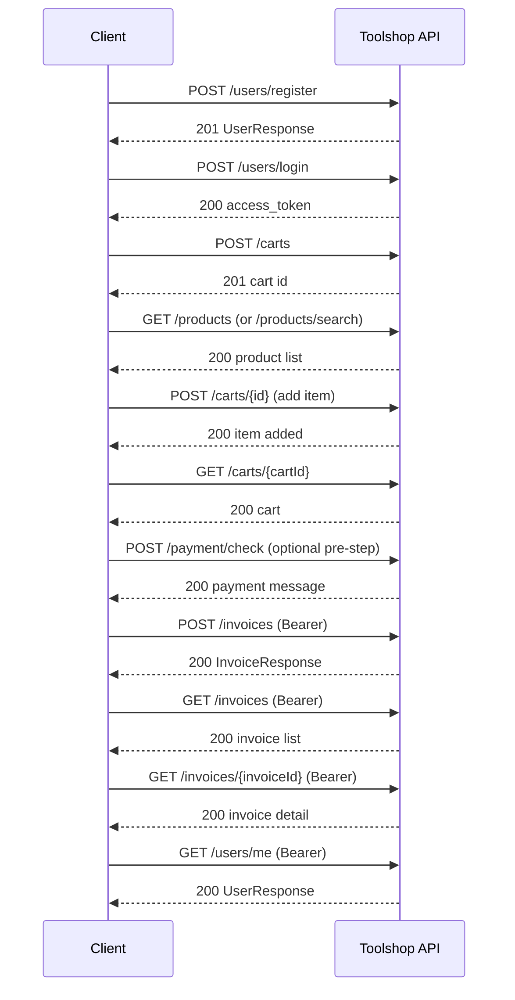

# Toolshop API Analysis — Core Lifecycle

**Source:** [Practice Software Testing Swagger UI](https://api.practicesoftwaretesting.com/api/documentation)  
**OpenAPI spec:** `https://api.practicesoftwaretesting.com/docs?api-docs.json` (OpenAPI 3.2.0, Toolshop API v5.0.0)  
**Base URL:** `https://api.practicesoftwaretesting.com`

This document covers only endpoints required for the assessment **core lifecycle** (register → login → token → products → cart → invoice → retrieval). Endpoints are taken from the published OpenAPI spec; nothing is invented.

---

## Authentication model

| Item | Detail |
|------|--------|
| Scheme | HTTP Bearer (`apiAuth`) |
| Format | JWT (`bearerFormat: JWT`) |
| Obtain token | `POST /users/login` → `access_token` |
| Header | `Authorization: Bearer <access_token>` |
| Refresh | `GET /users/refresh` (requires Bearer) |
| Invalidate | `GET /users/logout` (requires Bearer) |

**Token response fields (`TokenResponse`):** `access_token`, `token_type` (example: `Bearer`), `expires_in` (number, example: `120`).

---

## Core lifecycle (happy path)



---

## 1. User registration

### `POST /users/register`

| Attribute | Value |
|-----------|-------|
| **HTTP method** | `POST` |
| **Endpoint** | `/users/register` |
| **Authentication** | None |
| **Request body** | `UserRequest` (JSON) |
| **Success status** | `201` |

**Required fields (`UserRequest`):**

| Field | Type | Notes |
|-------|------|-------|
| `first_name` | string | max 40 |
| `last_name` | string | max 20 |
| `email` | string (email) | max 256 |
| `password` | string | min 8; must include uppercase, lowercase, number, symbol |

**Optional fields:**

| Field | Type | Notes |
|-------|------|-------|
| `address` | object | `street`, `house_number`, `city`, `state`, `country`, `postal_code` |
| `phone` | string | max 24 |
| `dob` | string (date) | valid date between 18 and 75 years ago |

**Important response fields (`UserResponse`, 201):** `id`, `first_name`, `last_name`, `email`, `address`, `phone`, `dob`, `enabled`, `created_at`, etc.

**Documented negative cases:**

| Status | When |
|--------|------|
| `400` | Bad Request |
| `401` | Unauthorized |
| `403` | Forbidden |
| `409` | Duplicate conflict (`DuplicateConflictResponse` — field-level messages or `{ "message": "Duplicate Entry" }`) |

**Dependencies:** None (entry point).

**Data required:** Unique email, valid password, required name fields; optional address block for profile completeness.

---

## 2. Authentication / login

### `POST /users/login`

| Attribute | Value |
|-----------|-------|
| **HTTP method** | `POST` |
| **Endpoint** | `/users/login` |
| **Authentication** | None |
| **Request body** | `AccountRequest` (JSON) |
| **Success status** | `200` |

**Required fields:**

| Field | Type | Example |
|-------|------|---------|
| `email` | string | `customer@practicesoftwaretesting.com` |
| `password` | string | `welcome01` |

**Optional fields:** None declared.

**Important response fields:** `access_token`, `token_type`, `expires_in`.

**Documented negative cases:** None listed in OpenAPI (only `200` documented).

**Dependencies:** User must exist (typically via `POST /users/register` or seeded account).

**Data required:** Valid `email` + `password`.

---

## 3. Token handling

### `GET /users/me` — verify token / current user

| Attribute | Value |
|-----------|-------|
| **HTTP method** | `GET` |
| **Endpoint** | `/users/me` |
| **Authentication** | **Required** — Bearer (`apiAuth`) |
| **Request body** | None |
| **Success status** | `200` |

**Important response fields:** Full `UserResponse` (`id`, `email`, `first_name`, `last_name`, `address`, …).

**Documented negative cases:** `401` Unauthorized.

**Dependencies:** Valid `access_token` from `POST /users/login` or `GET /users/refresh`.

**Data required:** Bearer token in `Authorization` header.

---

### `GET /users/refresh` — refresh token

| Attribute | Value |
|-----------|-------|
| **HTTP method** | `GET` |
| **Endpoint** | `/users/refresh` |
| **Authentication** | **Required** — Bearer |
| **Request body** | None |
| **Success status** | `200` |

**Important response fields:** New `access_token`, `token_type`, `expires_in`.

**Documented negative cases:** `400`, `401`.

**Dependencies:** Existing valid Bearer token.

---

### `GET /users/logout` — invalidate token

| Attribute | Value |
|-----------|-------|
| **HTTP method** | `GET` |
| **Endpoint** | `/users/logout` |
| **Authentication** | **Required** — Bearer |
| **Request body** | None |
| **Success status** | `200` |

**Important response fields:** `message` (example: `Successfully logged out`).

**Documented negative cases:** `400`, `401`.

**Dependencies:** Active Bearer token.

---

## 4. Cart creation

### `POST /carts`

| Attribute | Value |
|-----------|-------|
| **HTTP method** | `POST` |
| **Endpoint** | `/carts` |
| **Authentication** | None declared in OpenAPI |
| **Request body** | None |
| **Success status** | `201` |

**Required fields:** None.

**Optional fields:** None.

**Important response fields:** `id` (cart ID string, example: `"1234"`).

**Documented negative cases:** `404`, `405`, `422`.

**Dependencies:** None.

**Data required:** None; store returned `id` for all subsequent cart operations.

---

## 5. Product retrieval

### `GET /products`

| Attribute | Value |
|-----------|-------|
| **HTTP method** | `GET` |
| **Endpoint** | `/products` |
| **Authentication** | None |
| **Request body** | None |
| **Success status** | `200` |

**Optional query parameters:** `by_brand`, `by_category`, `is_rental`, `between` (e.g. `price,10,30`), `sort` (e.g. `name,asc`), `page`.

**Important response fields (paginated):** `current_page`, `data[]` (`ProductResponse`), `last_page`, `per_page`, `total`.

**`ProductResponse` fields:** `id`, `name`, `description`, `price`, `in_stock`, `is_rental`, `is_location_offer`, `brand`, `category`, `product_image`, …

**Documented negative cases:** `404`, `405`.

**Dependencies:** None.

**Data required:** Resolve `product_id` from `data[].id` where `in_stock: true` for purchase flows.

---

### `GET /products/search`

| Attribute | Value |
|-----------|-------|
| **HTTP method** | `GET` |
| **Endpoint** | `/products/search` |
| **Authentication** | None |
| **Request body** | None |
| **Success status** | `200` |

**Required query parameters:** `q` (search phrase; searches `name` column).

**Optional query parameters:** `page`.

**Important response fields:** Same paginated `ProductResponse` shape as `GET /products`.

**Documented negative cases:** `404`, `405`.

**Dependencies:** None.

**Data required:** Search term (e.g. product name fragment).

---

### `GET /products/{productId}`

| Attribute | Value |
|-----------|-------|
| **HTTP method** | `GET` |
| **Endpoint** | `/products/{productId}` |
| **Authentication** | None |
| **Path parameter** | `productId` (required, string) |
| **Success status** | `200` |

**Important response fields:** Single `ProductResponse` including `in_stock`.

**Documented negative cases:** `404`, `405`.

**Dependencies:** Valid `productId` from list/search.

---

## 6. Cart item operations

### `POST /carts/{id}` — add item to cart

| Attribute | Value |
|-----------|-------|
| **HTTP method** | `POST` |
| **Endpoint** | `/carts/{id}` |
| **Authentication** | None declared in OpenAPI |
| **Path parameter** | `id` — Cart ID (required) |
| **Success status** | `200` |

**Required body fields:**

| Field | Type |
|-------|------|
| `product_id` | string |
| `quantity` | integer |

**Optional body fields:** None.

**Important response fields:** `result` (example: `"item added or updated"`).

**Documented negative cases:** `404`, `405`, `422`.

**Dependencies:** `POST /carts` → `id`; `GET /products` → `product_id`.

**Data required:** Cart ID, in-stock product ID, quantity ≥ 1.

---

### `PUT /carts/{cartId}/product/quantity` — update quantity

| Attribute | Value |
|-----------|-------|
| **HTTP method** | `PUT` |
| **Endpoint** | `/carts/{cartId}/product/quantity` |
| **Authentication** | None declared in OpenAPI |
| **Path parameter** | `cartId` (required) |
| **Success status** | `200` (`UpdateResponse`) |

**Required body fields:** `product_id`, `quantity` (integer).

**Important response fields:** `success: true`.

**Documented negative cases:** `404`, `405`, `422`.

**Dependencies:** Cart with existing line item.

**Data required:** Cart ID, product ID, new quantity.

---

### `DELETE /carts/{cartId}/product/{productId}` — remove line item

| Attribute | Value |
|-----------|-------|
| **HTTP method** | `DELETE` |
| **Endpoint** | `/carts/{cartId}/product/{productId}` |
| **Authentication** | None declared in OpenAPI (401 documented on failure) |
| **Path parameters** | `cartId`, `productId` (required) |
| **Success status** | `204` |

**Documented negative cases:** `401`, `404`, `409`, `405`, `422`.

**Dependencies:** Cart containing the product.

---

### `DELETE /carts/{cartId}` — delete entire cart

| Attribute | Value |
|-----------|-------|
| **HTTP method** | `DELETE` |
| **Endpoint** | `/carts/{cartId}` |
| **Authentication** | None declared in OpenAPI (401 documented) |
| **Success status** | `204` |

**Documented negative cases:** `401`, `404`, `409`, `405`, `422`.

**Dependencies:** Existing cart ID.

---

## 7. Cart verification

### `GET /carts/{cartId}`

| Attribute | Value |
|-----------|-------|
| **HTTP method** | `GET` |
| **Endpoint** | `/carts/{cartId}` |
| **Authentication** | None declared in OpenAPI |
| **Path parameter** | `cartId` (required) |
| **Success status** | `200` |

**Important response fields:** OpenAPI `CartResponse` documents `id` only. Use this endpoint to confirm the cart exists before invoice creation; line-level detail is implied by prior add/update operations (schema may be incomplete in docs).

**Documented negative cases:** `404`, `405`.

**Dependencies:** Cart created via `POST /carts`; items added via `POST /carts/{id}`.

**Data required:** Cart ID.

---

## 8. Invoice generation

### `POST /payment/check` (pre-invoice payment validation)

| Attribute | Value |
|-----------|-------|
| **HTTP method** | `POST` |
| **Endpoint** | `/payment/check` |
| **Authentication** | None declared in OpenAPI |
| **Request body** | `PaymentRequest` |
| **Success status** | `200` |

**Body fields (`PaymentRequest`):**

| Field | Required in schema | Values |
|-------|-------------------|--------|
| `payment_method` | Not marked required in schema | `bank-transfer`, `cash-on-delivery`, `credit-card`, `buy-now-pay-later`, `gift-card` |
| `payment_details` | Not marked required in schema | Object; shape depends on method (COD = empty object) |

**Important response fields:** `message` (example: `"Success status"`).

**Documented negative cases:** None listed.

**Dependencies:** Typically called before `POST /invoices` in UI checkout flow.

**Data required:** Payment method + method-specific `payment_details` (empty `{}` for cash-on-delivery).

---

### `POST /invoices` — authenticated invoice (core assessment endpoint)

| Attribute | Value |
|-----------|-------|
| **HTTP method** | `POST` |
| **Endpoint** | `/invoices` |
| **Authentication** | **Required** — Bearer (`apiAuth`) |
| **Request body** | `InvoiceRequest` |
| **Success status** | `200` |

**Required fields (`InvoiceRequest`):**

| Field | Type | Notes |
|-------|------|-------|
| `billing_street` | string | |
| `billing_city` | string | |
| `billing_state` | string | Must be a string (422 if null/non-string) |
| `billing_country` | string | |
| `billing_postal_code` | string | Must be a string (422 if null/non-string) |
| `payment_method` | string (enum) | See payment methods below |
| `payment_details` | object | Required; COD = `{}` |
| `cart_id` | string | From `POST /carts` |

**Optional fields:** None in `InvoiceRequest` schema.

**`payment_method` enum:** `bank-transfer`, `cash-on-delivery`, `credit-card`, `buy-now-pay-later`, `gift-card`.

**`payment_details` oneOf shapes:**

| Method | Schema |
|--------|--------|
| `cash-on-delivery` | Empty object (`CashOnDeliveryDetails`) |
| `bank-transfer` | `bank_name`, `account_name`, `account_number` |
| `credit-card` | `credit_card_number`, `expiration_date`, `cvv`, `card_holder_name` |
| `gift-card` | `gift_card_number`, `validation_code` |
| `buy-now-pay-later` | `monthly_installments` |

**Important response fields (`InvoiceResponse`, 200):** `id`, `user_id`, `invoice_number` (e.g. `INV-2022000002`), `invoice_date`, billing fields, `subtotal`, `total`, `status`, `invoicelines[]` (with `product_id`, `quantity`, `unit_price`, nested `product`).

**Documented negative cases:** `401`, `404`, `405`, `422`.

**Dependencies:**

1. `POST /users/login` → Bearer token  
2. `POST /carts` → `cart_id`  
3. `POST /carts/{id}` → cart must contain items  
4. Optional: `POST /payment/check`  

**Data required:** Assessment billing example (below) + runtime `cart_id` + valid Bearer token.

---

### Assessment example invoice payload

From the assessment specification (matches `InvoiceRequest` for COD):

```json
{
  "billing_street": "Zoey Shore",
  "billing_city": "Hesselbury",
  "billing_state": "Florida",
  "billing_country": "TG",
  "billing_postal_code": "1234AA",
  "payment_method": "cash-on-delivery",
  "cart_id": "<runtime-cart-id-from-POST-/carts>",
  "payment_details": {}
}
```

**Notes:**

- `cart_id` is **runtime** — obtain from `POST /carts` response `id`.
- All billing fields are **required strings** per OpenAPI; omitting or sending non-string values yields `422`.
- `payment_details` is required but may be an empty object for cash-on-delivery.
- UI checkout requires **double Confirm** before invoice is created; API `POST /invoices` is the direct invoice-creation call.

---

### `POST /invoices/guest` (out of core authenticated lifecycle)

| Attribute | Value |
|-----------|-------|
| **HTTP method** | `POST` |
| **Endpoint** | `/invoices/guest` |
| **Authentication** | None |
| **Request body** | `InvoiceRequest` **plus** `guest_email`, `guest_first_name`, `guest_last_name` |
| **Success status** | `200` |

**Documented negative cases:** `422`.

Included for completeness; assessment AC2 uses authenticated `POST /invoices`.

---

## 9. Relevant user / invoice retrieval

### `GET /invoices` — list invoices

| Attribute | Value |
|-----------|-------|
| **HTTP method** | `GET` |
| **Endpoint** | `/invoices` |
| **Authentication** | **Required** — Bearer |
| **Optional query** | `page` |
| **Success status** | `200` |

**Important response fields:** Paginated `data[]` of `InvoiceResponse`; admin sees all, user sees own (per operation description).

**Documented negative cases:** `401`, `404`, `405`.

**Dependencies:** Authenticated user with at least zero invoices.

---

### `GET /invoices/{invoiceId}` — invoice detail

| Attribute | Value |
|-----------|-------|
| **HTTP method** | `GET` |
| **Endpoint** | `/invoices/{invoiceId}` |
| **Authentication** | **Required** — Bearer |
| **Path parameter** | `invoiceId` (required) |
| **Success status** | `200` |

**Important response fields:** Full `InvoiceResponse` including `invoicelines[]`, `total`, `invoice_number`, billing address fields.

**Documented negative cases:** `401`, `404`, `405`.

**Dependencies:** `POST /invoices` or existing invoice; `invoiceId` from list response `id`.

---

## 10. Negative / error handling

### Standard error responses (from OpenAPI components)

| Response | Status | Body shape | Typical use |
|----------|--------|------------|-------------|
| `UnauthorizedResponse` | `401` | `{ "message": "Unauthorized" }` | Missing/invalid Bearer token |
| `ItemNotFoundResponse` | `404` | `{ "message": "Requested item not found" }` | Resource not found |
| `ResourceNotFoundResponse` | `404` | `{ "message": "Resource not found" }` | Cart/product not found |
| `DuplicateConflictResponse` | `409` | Field errors or `{ "message": "Duplicate Entry" }` | Duplicate email on register |
| `UnprocessableEntityResponse` | `422` | Validation errors (field → string[]) | Invalid body, weak password, invalid billing types |
| `MethodNotAllowedResponse` | `405` | `{ "message": "Method is not allowed..." }` | Wrong HTTP method |
| `ConflictResponse` | `409` | (description only) | Entity in use |

### Lifecycle negative scenarios (mapped to endpoints)

| Scenario | Endpoint | Expected status (documented) | Data / setup |
|----------|----------|------------------------------|--------------|
| Register weak password | `POST /users/register` | `422` | Password failing complexity rules |
| Register duplicate email | `POST /users/register` | `409` | Existing `email` |
| Register missing required field | `POST /users/register` | `422` / `400` | Omit `email`, `password`, etc. |
| Invoice without auth | `POST /invoices` | `401` | No `Authorization` header |
| Invoice invalid/missing billing | `POST /invoices` | `422` | Omit `billing_street` or non-string `billing_postal_code` |
| Invoice invalid cart | `POST /invoices` | `404` / `422` | Unknown or empty `cart_id` |
| Add to cart invalid product | `POST /carts/{id}` | `404` / `422` | Bad `product_id` or quantity |
| Get unknown cart | `GET /carts/{cartId}` | `404` | Invalid cart ID |
| Get profile without token | `GET /users/me` | `401` | No Bearer token |
| Product not found | `GET /products/{productId}` | `404` | Invalid ID |

### Supporting endpoint (address lookup — used by UI billing)

### `GET /postcode-lookup`

| Attribute | Value |
|-----------|-------|
| **Required query** | `country`, `postcode` |
| **Optional query** | `house_number` |
| **Success status** | `200` |
| **Response fields** | `street`, `house_number`, `city`, `state`, `country`, `postcode` |
| **Negative cases** | `422`, `502` |

Relevant when billing address is auto-filled (e.g. assessment country `TG`, postcode `1234AA`).

---

## Endpoint quick reference (core lifecycle only)

| # | Lifecycle step | Method | Endpoint | Auth |
|---|----------------|--------|----------|------|
| 1 | Register | `POST` | `/users/register` | No |
| 2 | Login | `POST` | `/users/login` | No |
| 3a | Verify token / user | `GET` | `/users/me` | Bearer |
| 3b | Refresh token | `GET` | `/users/refresh` | Bearer |
| 3c | Logout | `GET` | `/users/logout` | Bearer |
| 4 | Create cart | `POST` | `/carts` | No* |
| 5a | List products | `GET` | `/products` | No |
| 5b | Search products | `GET` | `/products/search?q=` | No |
| 5c | Product detail | `GET` | `/products/{productId}` | No |
| 6a | Add to cart | `POST` | `/carts/{id}` | No* |
| 6b | Update quantity | `PUT` | `/carts/{cartId}/product/quantity` | No* |
| 6c | Remove item | `DELETE` | `/carts/{cartId}/product/{productId}` | No* |
| 7 | Verify cart | `GET` | `/carts/{cartId}` | No* |
| 8a | Payment check | `POST` | `/payment/check` | No* |
| 8b | Create invoice | `POST` | `/invoices` | **Bearer** |
| 9a | List invoices | `GET` | `/invoices` | Bearer |
| 9b | Invoice detail | `GET` | `/invoices/{invoiceId}` | Bearer |

\*No `security` requirement declared in OpenAPI for these cart/payment paths; some operations document `401` on failure.

---

## Test data implications

| Runtime data | Source |
|--------------|--------|
| `access_token` | `POST /users/login` |
| `cart_id` | `POST /carts` → `id` |
| `product_id` | `GET /products` or `GET /products/search` → `data[].id` |
| `invoiceId` | `POST /invoices` or `GET /invoices` → `id` |
| Billing (assessment) | Zoey Shore, Hesselbury, Florida, TG, 1234AA |
| Payment (assessment) | `cash-on-delivery` + `payment_details: {}` |

---

## Gaps / schema limitations (from OpenAPI)

- `POST /users/login` documents only `200`; no explicit `401` for invalid credentials in the spec.
- `CartResponse` schema lists only `id`; line-item structure is not fully described (verify via integration tests).
- `PaymentRequest` does not mark `payment_method` / `payment_details` as required despite invoice flow needing them.
- Guest invoice (`POST /invoices/guest`) is documented but outside authenticated AC2 path.

---

*Generated from Toolshop API OpenAPI 3.2.0 (v5.0.0). Re-fetch `https://api.practicesoftwaretesting.com/docs?api-docs.json` if the deployed API version changes.*
